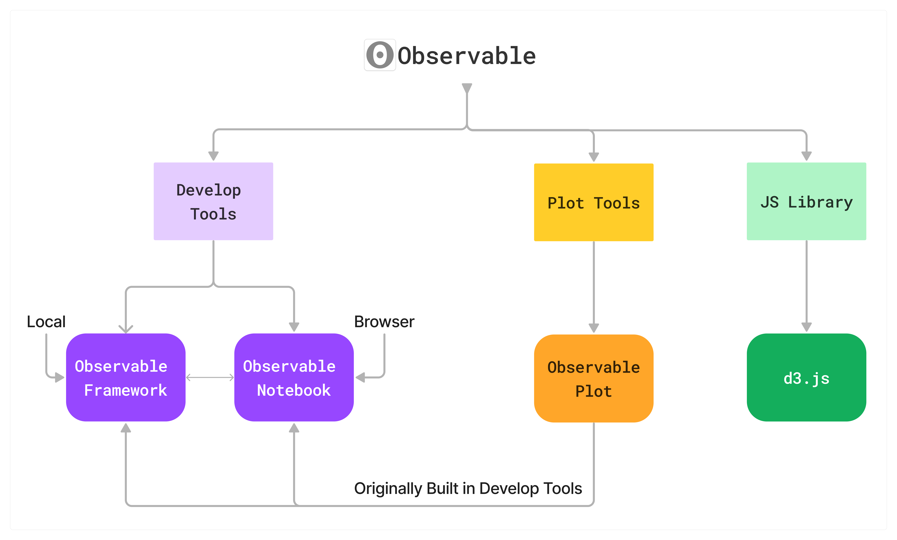

## Observable Framework - Tutorial

<em> All tutorials are based on [Observable Framework Official Documentation](https://observablehq.com/framework/)</em>

### Getting Started - What's Observable Framework?

* #### Observable Framework is a [local data apps develop tools](https://observablehq.com/framework/what-is-framework) for Observable Proejcts.

> ##### It is a perfect tool to create fast, beautiful data apps, dashboards, and reports from the command line. Write Markdown, JavaScript, SQL, Python, R… and any language you like. Free and open-source.

<em>Attached is the struture of Observable [LEARN MORE](https://observablehq.com/documentation/) and where the Observable Framework is positioned in the structure.</em>




#### Step-1 [Install the Observable Framework](https://observablehq.com/framework/getting-started)

#### Step-2 [Knowing the Observable Framework Struture](https://observablehq.com/framework/project-structure)
        .
    ├─ src                    # source root
    │  ├─ .observablehq
    │  │  ├─ cache            # data loader cache
    │  │  └─ deploy.json      # deployment metadata
    │  ├─ components
    │  │  └─ dotmap.js        # shared JavaScript module
    │  ├─ data
    │  │  └─ quakes.csv.ts    # data loader
    │  ├─ index.md            # home page
    │  └─ quakes.md           # page
    ├─ .gitignore
    ├─ README.md
    ├─ observablehq.config.js # project configuration
    ├─ package.json           # node package dependencies
    └─ yarn.lock              # node package lockfile

#### Step-3 Use of Observable Framework

* ##### Load Data
    * Local: put the data in to <em>src/data</em> folder. (e.g data-example.json // data-example.csv, etc)
    * Remote: You can use python/js to write a program to fecth the data, the script file will be stored in <em>src/data</em> folder 
        * Js-example: 
        * forecast.json.js
```
        const longitude = -77.04;
        const latitude = 38.90;

        async function json(url) {
        const response = await fetch(url);
        if (!response.ok) throw new Error(`fetch failed: ${response.status}`);
        return await response.json();
        }

        const station = await json(`https://api.weather.gov/points/${latitude},${longitude}`);
        const forecast = await json(station.properties.forecastHourly);

        process.stdout.write(JSON.stringify(forecast));
```     
* The Observable Framework will automatcially run the code and export the data file in <em>forecast.json</em>
* If the data file will be updated everytime requested. [Learm More](https://observablehq.com/framework/loaders)
    
* ##### Visualize Data
<em>You can easily visualized the data in the markdown file</em>
    * ##### Syntax:
    
    Layout:
        You can write your HTML, CSS to structure your project directly in markdown file like you are writing a seperate HTML, CSS file. Observable Framework presets some features for you to easily layout your project. [Learn More](https://observablehq.com/framework/markdown)
    <br><br>
    Visualization: You can use Javascript to do all the visualizations, aniamtion and interaction.

---------------------

Here is a example Markdown file:

    ---
    title: My favorite page
    toc: false
    ---

    // JavaScript Code should be inside the ```js ```
    ```js
    const launches = FileAttachment("data/launches.json").json({typed: true});
    // load data

    ```

    ```js
    // Plot the data
    const simplePlot = Plot.rectY(launches, {y: "count", x: "Date"}).plot();
    ```

    ```js
    // display the Plot
    display(simplePlot);
    ```

---- 
Breakdown of the Markdown
<br>
1. [Front Matter](https://observablehq.com/framework/markdown#front-matter)-Basic info for the page
```
---
title: My favorite page
toc: false
---
```
2. Use [Observable Plot](https://observablehq.com/plot/) to draw the Plot
    * load the data file
    * Choose the Plot you want to visualize from [Plot Lib](https://observablehq.com/@observablehq/plot-gallery)
    * You will find the example code for each tyoe of Plot from [Plot Lib](https://observablehq.com/@observablehq/plot-gallery)
    * Display the Plot
    * Example: 

    Basic Logic Example:

        

        // load data
        ```js
        const launches = FileAttachment("data/launches.json").json({typed: true});
        ```
        // use Plot Library's function to visualize the data (easy way)
        ```js
        // launches is the data we just loaded
        const simplePlot = Plot.rectY(launches, {y: "count", x: "Date"}).plot();
        ```
        display the Plot
        ```js
        // simplePlot is the Plot we just Made
        display(simplePlot)
        ```
        You should be able to see some Plot like [this](https://observablehq.com/@observablehq/plot-vertical-bar-chart?intent=fork)


3. Formatting your pages - You can write HTML directly into Markdown. --> You can put the Plot in where you want

JS+HTML Example:

        

        // load data(no changes)
        ```js
        const launches = FileAttachment("data/launches.json").json({typed: true});
        ```

        // ONE MORE STEP, set the color scale for the Plot

        ```js
        const color = Plot.scale({
        color: {
            type: "categorical",
            domain: d3.groupSort(launches, (D) => -D.length, (d) => d.state).filter((d) => d !== "Other"),
            unknown: "var(--theme-foreground-muted)"
        }
        });

        ```

        // use Plot Library's function to visualize the data 
        // not just use it, create a function for it
        ```js
        // data, {width} are local Varibales inside the function
        ```js
        function launchTimeline(data, {width} = {}) {
        return Plot.plot({
            title: "Launches over the years",
            width,
            height: 300,
            y: {grid: true, label: "Launches"},
            color: {...color, legend: true},
            marks: [
            Plot.rectY(data, Plot.binX({y: "count"}, {x: "date", fill: "state", interval: "year", tip: true})),
            Plot.ruleY([0])
            ]
        });
        }
        ```
        ```
        //display the Plot
        ```js
        // We can call the function inside a html div 
        <div class="grid grid-cols-1">
        <div class="card">
            ${resize((width) => vehicleChart(launches, {width}))}
        </div>
        </div>
        ```
 